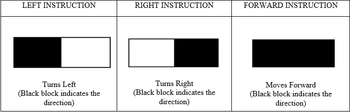

# Shield-Bot Arduino Based Digital Warehouse Transportation System

# **Disclaimer:**

**This project has been developed as part of the group coursework for the module Digital and Embedded Electronic Systems at the University of Greenwich during Year II of Computer Engineering BEng (Hons) (Academic Year 2022/23)** 

**All credits must be given to the creators and the University of Greenwich**

## Introduction

This project aims to apply the knowledge and skills learned in relation to the Arduino UNO and its development environment. The goal was to develop a small-scale digital warehouse transportation system using a ShieldBot two-wheeled differential drive vehicle. 

The vehicle starts from its home position, reads instructions to move to one of three loading bays, pauses for two seconds at the bay, and then returns to its home position for the next instruction. The process is repeated until navigational faults prevent accurate home positioning.

## Methodology

### ShieldBot Travel Plan

The system involves three bases (Base 1, Base 2, Base 3) placed 1 meter apart. The ShieldBot reads instructions from the home base using 'Line Finder' sensors (S1, S3, S5) to move in a particular direction. The instructions are represented by black/white blocks in the home base.

----

### Plan Execution

#### Materials Used
- ShieldBot with Arduino UNO and USB charger
- Reflectance sensors
- Breadboard & wires

#### Distance Calculation

The wheels’ rotations were used to calculate the distance traveled. The ShieldBot's wheel diameter is 4.4 cm, giving a circumference of approximately 0.138 meters. To travel 1 meter, the wheels need to make about 8 full rotations. Reflectance sensors attached to encoder wheels counted ticks, triggering 48 times for 1-meter movement (8 rotations with 6 black/white segments per rotation).

#### Stabilizing Movement

A key challenge was wobbling due to uneven wheel speeds. To fix this, the tick rate of each wheel was monitored, and the ShieldBot was adjusted to move straight by compensating for differences in tick counts.

## Arduino Coding

The ShieldBot was programmed using the Arduino IDE. The following sections explain key code snippets:

- **Turning Left/Right (Code I)**: `shieldbot.drive(127,-128)` for turning left and `shieldbot.drive(-128,127)` for turning right.
- **Moving Straight (Code II)**: Stabilizing movement by monitoring tick counts.
- **High/Low Value Reading (Code III)**: Using `analogRead()` to get sensor values.
- **Traveling 1 Meter (Code IV)**: Counting ticks to ensure precise 1-meter travel.
- **Final Code (Code V)**: Combined code for executing all tasks.

## Testing

### Key Tests
1. **Turning 90 Degrees Left/Right**
   - *Expected*: Turns 90 degrees based on instructions.
   - *Result*: Successfully turned 90 degrees.

2. **1-Meter Travel Accuracy**
   - *Expected*: Travels exactly 1 meter.
   - *Result*: Accurately stopped after traveling 1 meter.

3. **Travel Accuracy to Base**
   - *Expected*: Moves to the instructed base and returns home.
   - *Result*: Successfully traveled to the base and returned.

4. **Stability Testing**
   - *Expected*: Travels in a straight line without wobbling.
   - *Result*: Stable straight-line travel achieved.

5. **Combined Code Testing**
   - *Expected*: Full functionality of movement and turns.
   - *Result*: Encountered issues with turning; further tuning required.

## Challenges and Solutions

- **Sensor Inaccuracy**: Reflectance sensor counted the same segment multiple times.
  - *Solution*: Added delay in code to avoid multiple counts.
  
- **Inaccurate Tick Counting**: Increased encoder segments from 8 to 12 for more precise ticks.
  
- **Wobbling Issue**: Corrected by monitoring the tick rate of each wheel and adjusting accordingly.

## Conclusion

This project provided valuable experience in using the Arduino UNO and ShieldBot, while also addressing technical challenges related to movement and sensor accuracy. The final system successfully demonstrated a functional digital warehouse transportation system, improving our knowledge in embedded systems and robotics.
